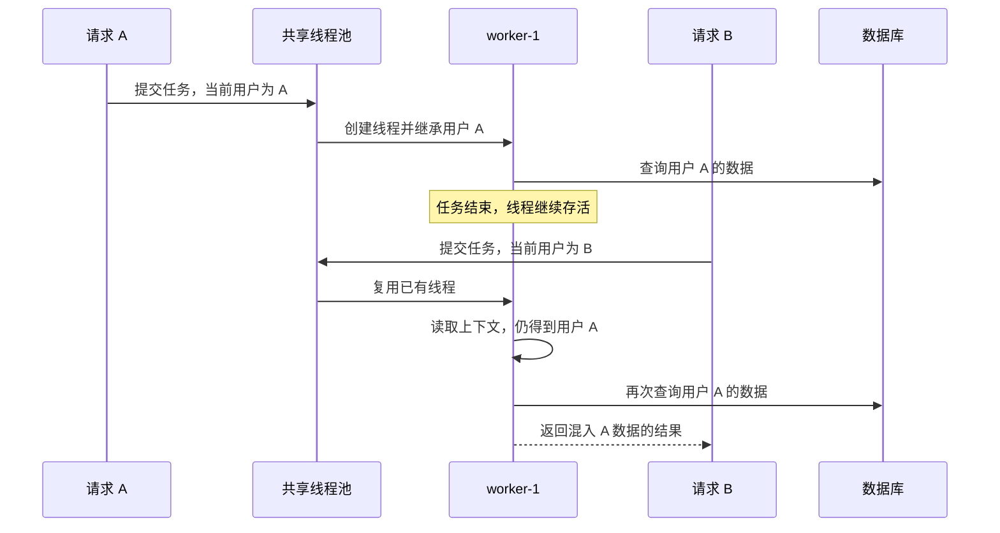

# 被线程池记住的用户：一次线程上下文数据错乱事故复盘

电话响起时，我刚睡着。

屏幕上的时间已经越过午夜。电话那头没有寒暄，只有一句足以让人立刻清醒的话：

> 有用户投诉，在自己的付款方式列表里看到了不属于自己的银行账户。线上包已经回滚，需要马上查清原因。

这类问题和普通的接口报错完全不同。超时可以重试，异常可以降级，但跨用户的数据错乱触碰的是系统最基本的隔离边界。哪怕只出现一次，也必须先按最高风险处理。

我打开电脑，先确认了两件事：回滚后的版本已经稳定，异常窗口没有继续扩大；投诉描述中的“其他人的银行账户”确实来自服务端响应，不是前端缓存或页面残留。

然后，疑问出现了。

这次上线，按变更说明看，主要是在修复异步任务里 Sleuth `traceId` 丢失的问题。没有修改银行账户查询条件，也没有改权限校验，更没有碰用户和账户的关联关系。

一个链路追踪改动，为什么会把甲用户的数据送给乙用户？

## 先从最不可能的地方开始

最初的怀疑很自然：

- 查询是不是少了用户条件；
- 缓存键是不是漏了用户维度；
- 多线程汇总结果时是不是共用了集合；
- 前端是不是复用了上一个登录用户的状态；
- 数据库里是不是已经存在错误关联。

这些方向都值得检查，但它们没有解释一个关键事实：回滚之后，问题立刻停止了。

这意味着事故与新旧版本之间的差异高度相关。与其继续在整个调用链里漫游，不如先回答一个更直接的问题：这两个版本到底改了什么？

我把版本差异按功能、日志、依赖和并发模型重新分类。大量日志删除、脱敏调整和模型字段变化掩盖了一个很小、却改变了系统运行方式的修改：

```java
ExecutorService executorA = Executors.newFixedThreadPool(4);
try {
    submitTasksA(executorA);
} finally {
    executorA.shutdown();
}
```

变成了：

```java
@Bean
ThreadPoolTaskExecutor sharedExecutorA() {
    return createExecutorA();
}
```

我盯着这个差异看了几秒。

然后立刻去找用户上下文的实现。

```java
final class ContextA {
    private static final InheritableThreadLocal<Map<String, Object>> DATA_A =
        new InheritableThreadLocal<>();
}
```

至此，事故的轮廓已经出现了。

应用级共享线程池和 `InheritableThreadLocal` 被放在了一起。前者希望线程长期存活、反复处理不同请求；后者却只在线程创建时继承一次父线程的值。

这两个设计对线程生命周期的假设，从一开始就是冲突的。

## InheritableThreadLocal 到底继承了什么

普通 `ThreadLocal` 的值只属于当前线程。`InheritableThreadLocal` 在此基础上增加了一项能力：创建子线程时，子线程可以从父线程得到一个初始值。

关键不是“可以继承”，而是“什么时候继承”。

根据 JDK 的定义，`childValue()` 会在子线程创建时根据父线程的当前值计算子线程初始值。默认实现只是把父线程的值原样返回：

```java
protected T childValue(T parentValue) {
    return parentValue;
}
```

如果保存的是一个可变 `Map`，父子线程最初拿到的甚至是同一个对象引用，而不是自动生成的副本。

这套机制用于生命周期明确的临时子线程时，看起来很方便：

```text
请求线程：用户 A
    └── 创建子线程
            └── 继承用户 A
                    └── 执行完成并退出
```

旧代码恰好就是这种模型。每个请求创建一组新线程，任务结束后关闭线程池。即使设计中存在隐式上下文依赖，线程的生命也基本被限制在当前请求内。

改成共享线程池后，时间关系完全不同：

```text
请求 A 到达
    └── 创建 worker-1
            └── worker-1 继承用户 A

请求 A 结束
    └── 只清理请求线程的上下文

请求 B 到达
    └── 复用 worker-1
            └── worker-1 仍然持有用户 A
```

请求线程调用 `remove()`，只能删除请求线程自己的 `ThreadLocal` 条目。它无法隔空清理另一个长期存活的 worker。

而线程池提交的是任务，不是新线程。任务 B 被放进队列，并不会触发一次新的 `InheritableThreadLocal` 继承。

## 错误用户是怎样进入查询的

只理解线程上下文还不够。要形成真实的数据错乱，业务代码必须在异步任务中读取这个旧值。

问题代码可以抽象成下面这样：

```java
Map<String, Object> getDataA(Long idA) {
    List<DataA> listA = repositoryA.findDataA(idA);

    for (DataA dataA : listA) {
        sharedExecutorA.execute(new TaskA(dataA));
    }

    return collectDataA();
}
```

外层看起来没有问题。`idA` 来自当前请求，`listA` 也属于用户 B。

真正的转折发生在子任务里：

```java
final class TaskA implements Callable<ResultA> {
    private final DataA dataA;

    @Override
    public ResultA call() {
        Long idA = ContextA.getIdA();
        List<DataB> listB = repositoryB.findDataB(idA);

        return ResultA.of(dataA, listB);
    }
}
```

于是，同一个结果对象中出现了两个来源不同的身份维度：

```text
dataA  → 当前请求的用户 B
idA    → worker 记住的用户 A
listB  → 用户 A 的银行账户
```

这也解释了为什么问题集中出现在银行账户列表，而不是整个付款方式接口完全变成另一个用户的数据。调用链的一部分使用显式参数，另一部分依赖线程上下文，最终拼出了一份逻辑上不可能存在的混合结果。



## 为什么它不是每次都发生

如果每个请求都稳定读到同一个错误用户，问题反而容易定位。真正让事故难以复现的，是线程池按需创建和调度任务的方式。

`ThreadPoolExecutor` 默认会随着任务到来逐步创建 core worker。假设核心线程数是 4：

```text
worker-1 可能继承用户 A
worker-2 可能继承用户 A
worker-3 可能继承用户 C
worker-4 可能继承用户 D
```

具体由谁“初始化”某个 worker，取决于服务启动后的请求顺序和并发情况。等核心线程创建完毕，后续任务再随机落到这些长期存活的线程上。

于是线上现象会显得毫无规律：

- 同一个用户刷新两次，结果可能不同；
- 服务重启之后，错误关联对象可能变化；
- 多账户请求的多个子任务可能落到不同 worker；
- 压测环境未必复现，因为初始化线程池的请求顺序不同。

它看起来像随机的数据污染，实际上只是被线程调度隐藏起来的确定性行为。

## 开发者当时在想什么

把提交历史按时间重新排列后，这次修改的动机并不难理解。

原实现每次请求都会创建并关闭一个固定线程池。请求量上来后，这意味着持续创建线程、分配资源、切换上下文，再销毁线程。把它改成 Spring 管理的单例线程池，是很常见的优化方向。

与此同时，异步任务里的 Sleuth `traceId` 无法稳定延续。为了让日志仍然属于原请求，代码又增加了任务包装器，大致做了这些事：

```java
Runnable wrapA(Runnable taskA) {
    Map<String, String> mapA = MDC.getCopyOfContextMap();
    Span spanA = tracerA.currentSpan();

    return () -> {
        restoreMdcA(mapA);
        try (Scope scopeA = tracerA.withSpan(spanA)) {
            taskA.run();
        } finally {
            clearMdcA();
        }
    };
}
```

这个方向本身没有错。`traceId` 属于一次任务，需要在提交时捕获，在执行时恢复，并在结束后清理。

问题在于，代码只处理了 Sleuth span 和 MDC，却漏掉了应用自己的用户上下文。开发者解决了“这条日志属于哪个请求”，却没有同步解决“这个任务代表哪个用户”。

从日志观察，trace 链路甚至可能是完全正确的：请求 B 的日志拥有 B 的 `traceId`，但同一个任务从 `InheritableThreadLocal` 里读取到的却是用户 A。

这正是这类事故最危险的地方：可观测性告诉你任务属于 B，业务代码实际使用的身份却属于 A。

## 回滚之后，真正漫长的工作才开始

定位根因并没有花太久。真正耗时的是之后的数据核查。

代码可以在几分钟内回滚，已经发生过的请求却不能。修复工作需要围绕事故窗口逐层确认：

- 哪些实例运行过问题版本；
- 每个实例的共享 worker 可能继承过哪些用户上下文；
- 哪些请求调用过受影响的异步路径；
- 错误数据是否只出现在响应中；
- 用户是否基于错误列表执行过后续操作；
- 是否存在需要纠正的持久化记录或业务状态。

线程池没有提供一份“这个 worker 最初继承了谁”的历史清单。普通日志记录的是任务执行时的 `traceId`，也未必记录 worker 内真实读取到的用户 ID。很多时候，只能把访问日志、线程名、请求轨迹和数据库记录重新拼在一起，缩小可能受影响的范围。

这是一种令人疲惫的修复：代码中的错误已经消失，团队却还要继续追赶它留下的每一个可能性。

也正是在这个阶段，我开始重新理解事故修复的含义。修复从来不只是让新请求恢复正确，还包括证明旧请求究竟发生过什么。

## 正确修复不是换一种 ThreadLocal

回滚到每请求线程池可以快速止血，但它只是恢复了过去碰巧安全的线程生命周期，也重新带回了线程频繁创建的问题。

更直接的修复，是消除业务身份对隐式线程上下文的依赖。外层流程本来就已经拥有可信的用户标识，应当把它作为任务输入继续传递：

```java
for (DataA dataA : listA) {
    sharedExecutorA.execute(new TaskA(idA, dataA));
}
```

```java
final class TaskA implements Callable<ResultA> {
    private final Long idA;
    private final DataA dataA;

    @Override
    public ResultA call() {
        List<DataB> listB = repositoryB.findDataB(idA);
        return ResultA.of(dataA, listB);
    }
}
```

用户 ID 是业务查询条件，不是日志装饰信息。显式传参让依赖可以被代码审查、类型系统和单元测试直接看见，也不再依赖任务恰好运行在哪个线程。

如果某些基础设施确实必须传播上下文，则要在任务提交时捕获一份防御性副本，在 worker 执行前设置，并在 `finally` 中恢复或清理：

```java
ContextData dataA = contextA.copy();

return () -> {
    ContextData oldDataA = contextA.get();
    try {
        contextA.set(dataA);
        taskA.run();
    } finally {
        contextA.restore(oldDataA);
    }
};
```

但即便如此，支付、授权、租户和账户归属等关键业务条件仍应优先显式传递。上下文传播适合解决横切关注点，不应该成为核心权限条件的唯一来源。

## 那个必须补上的测试

传统单元测试通常只验证“一个用户的一次调用”，而这个问题必须通过“多个用户复用同一个线程”才能出现。

最小回归测试反而很简单：使用只有一个 worker 的共享线程池，先执行用户 A，再执行用户 B。

```java
@Test
void workerAUsesCurrentData() {
    ExecutorService executorA = Executors.newFixedThreadPool(1);

    invokeA("A", executorA);
    ResultA resultA = invokeA("B", executorA);

    assertThat(resultA.ownerA()).isEqualTo("B");
}
```

如果实现仍然依赖 `InheritableThreadLocal`，第二次调用会稳定暴露问题。与其在线上等待线程调度替我们抽奖，不如在测试中主动控制线程生命周期。

## 线程池记住的，不应该是用户

这次事故表面上始于一次 Sleuth `traceId` 修复，真正改变的却不是日志，而是线程的生命周期。

原来的代码隐含着一个脆弱前提：子线程与当前请求共同出生，也共同结束。共享线程池打破了这个前提，让曾经只活几百毫秒的用户上下文，住进了可以存活数天的 worker。

所以问题不只是“不要在线程池里使用 `InheritableThreadLocal`”。更值得记住的是：

> 上下文的生命周期必须与它代表的业务作用域一致。

请求级身份不应该依附于应用级线程；任务级 trace 不应该靠线程创建时碰巧继承；关键授权条件也不应该藏在调用者看不见的静态上下文中。

深夜电话之后，事故最终被止住，错乱数据的核查仍在继续。而那个最初看起来毫无攻击性的改动，也留下了一条足够清晰的教训：

当我们把线程从“一次请求专用”改成“整个应用共享”时，不能只问性能变好了多少。

还必须问一句：

> 这个线程，究竟还记得谁？

## 参考资料

- [Java SE 8：InheritableThreadLocal](https://docs.oracle.com/javase/8/docs/api/java/lang/InheritableThreadLocal.html)
- [Java SE 8：ThreadPoolExecutor](https://docs.oracle.com/javase/8/docs/api/java/util/concurrent/ThreadPoolExecutor.html)
