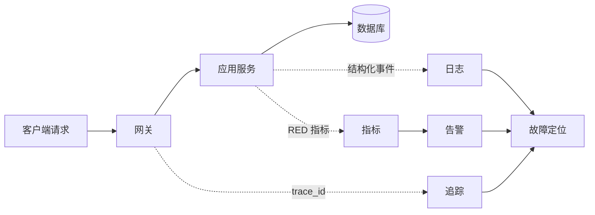

# 从请求到告警：可观测服务的最小闭环

可观测性不是多装几个采集器，而是让一次用户请求能被定位、解释和复盘。最小闭环应回答三个问题：发生了什么、影响了谁、下一步做什么。



## 三类信号各司其职

| 信号 | 最适合回答         | 最低要求                       |
| ---- | ------------------ | ------------------------------ |
| 指标 | 问题是否正在扩大   | 请求量、错误率、延迟分位数     |
| 日志 | 某次失败经历了什么 | 时间、级别、服务名、`trace_id` |
| 追踪 | 时间消耗在哪个依赖 | 跨服务上下文、关键 span 属性   |

服务可用率可以写成：

$$
A = \frac{N_{successful}}{N_{total}} \times 100\%
$$

但单个平均值会掩盖尾部问题。告警应同时考虑错误预算消耗速度和持续时间，避免每次瞬时抖动都唤醒值班人员。

## 让告警可以行动

每条告警都应包含受影响的服务与环境、观察窗口、当前值与阈值、仪表盘链接，以及第一步排查命令。没有明确处置动作的告警更适合作为仪表盘信号。

```shell
kubectl -n sweetwater get pods -l app=payments
kubectl -n sweetwater logs deploy/payments --since=15m --prefix
```

上线后用一次受控失败验证整条链路：制造可识别错误，确认指标上升、日志携带相同 `trace_id`、追踪标记错误，并检查告警能否指向正确的运行手册。
