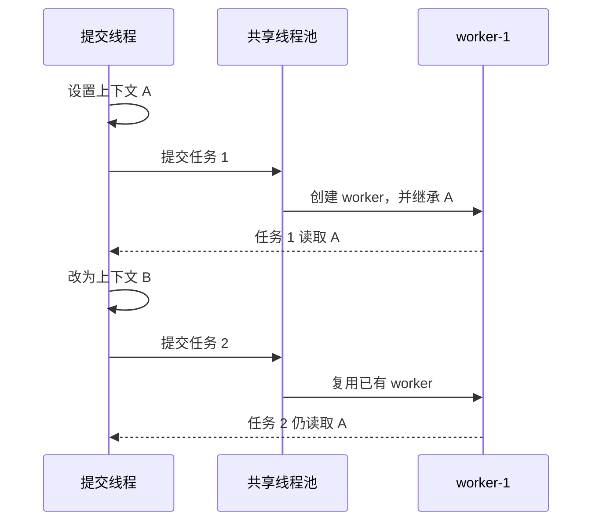

# 共享线程池为什么会放大线程上下文风险

线程池通过复用 worker 避免频繁创建和销毁线程。这个设计能够降低资源开销，却也改变了线程与业务请求之间的关系：一个 worker 不再只服务一个调用者，而是可能连续执行许多互不相关的任务。

如果业务代码把请求身份、租户或其他短生命周期状态绑定在线程上，共享线程池就会让这些状态活得比请求更久。

## 任务不是线程

调用 `Executor.execute()` 或 `ExecutorService.submit()` 时，提交的是任务：

```java
executorA.submit(taskA);
```

线程池可能创建一个新 worker 执行它，也可能把它放进队列，等待某个已经存在的 worker。调用一次 `submit()`，不等于调用一次 `new Thread(...)`。

这一区别对 `InheritableThreadLocal` 至关重要：

- `InheritableThreadLocal` 在线程创建时计算初始值；
- 线程池在任务提交时选择创建或复用 worker；
- 复用 worker 时没有新线程，也就没有新的继承动作。

## 一个 worker 如何记住旧上下文

固定大小线程池通常按需创建 worker。下面的例子使用一个 worker，让复用过程稳定发生：

```java
InheritableThreadLocal<String> contextA = new InheritableThreadLocal<>();
ExecutorService executorA = Executors.newFixedThreadPool(1);

try {
    contextA.set("A");
    String firstA = executorA.submit(contextA::get).get();

    contextA.set("B");
    String secondA = executorA.submit(contextA::get).get();

    assertThat(firstA).isEqualTo("A");
    assertThat(secondA).isEqualTo("A");
} finally {
    contextA.remove();
    executorA.shutdownNow();
}
```

第一次提交时，线程池需要创建 worker。这个 worker 在上下文为 `A` 时得到初始值。第二次提交只复用同一个 worker，因此不会根据提交线程当前的 `B` 重新初始化。



从线程池角度看，这是正常复用；从业务请求角度看，worker 却携带了过期状态。

## 为什么提交线程的 remove 没有用

请求结束时清理当前线程是正确做法：

```java
try {
    contextA.set("A");
    invokeA();
} finally {
    contextA.remove();
}
```

但这个 `remove()` 只操作提交线程自己的线程本地存储。worker 拥有独立的线程本地存储，并且仍在池中存活。提交线程既不会自动访问它，也无法通过自己的 `remove()` 删除它的条目。

清理必须发生在保存该条目的线程上，并与任务执行边界绑定。

## 预创建 worker 也不是修复

如果应用启动时就在空上下文中预先创建全部 worker，它们可能不会继承任何请求状态。此时问题可能表现为异步任务读取不到上下文，而不是读取其他调用者的上下文。

这只能改变故障表现，不能建立可靠的任务传播语义：

| worker 创建方式   | 可能的初始状态     | 后续任务风险       |
| ----------------- | ------------------ | ------------------ |
| 在请求中按需创建  | 创建时请求的值     | 长期读取旧值       |
| 在启动阶段预创建  | 空值或启动线程的值 | 读取不到当前请求值 |
| worker 超时后重建 | 重建时调用者的值   | 故障对象随时间变化 |

任务正确性不应取决于 worker 恰好由哪个线程、在哪个时间点创建。

## 深复制不能修复生命周期错位

重写 `childValue()`，把父线程中的可变对象复制一份，可以避免父子线程并发修改同一个对象：

```java
@Override
protected ContextData childValue(ContextData parentValue) {
    return parentValue == null ? null : parentValue.copy();
}
```

但是 worker 仍然只在创建时得到这份副本。后续任务不会触发新的 `childValue()`，因此深复制解决的是对象共享，不是任务级上下文传播。

## 业务身份应显式传递

用户、租户、账户归属和授权范围都属于业务输入。调用者已经拥有这些值时，最直接的设计是让任务显式接收它们：

```java
for (DataA dataA : listA) {
    executorA.submit(new TaskA(idA, dataA));
}
```

```java
final class TaskA implements Callable<ResultA> {
    private final Long idA;
    private final DataA dataA;

    TaskA(Long idA, DataA dataA) {
        this.idA = idA;
        this.dataA = dataA;
    }

    @Override
    public ResultA call() {
        return loadResultA(idA, dataA);
    }
}
```

这种方式让依赖出现在构造函数和方法签名中。代码审查、类型检查和单元测试都可以直接确认任务使用的是哪个身份。

关键查询条件或授权条件不应只存在于静态线程上下文中。

## 基础设施上下文按任务传播

日志标签、追踪信息等横切上下文确实可能需要跨越异步边界。它们应在提交任务时捕获，在 worker 执行前安装，并在 `finally` 中恢复 worker 原来的状态：

```java
Runnable wrapA(Runnable taskA, ContextStore contextA) {
    ContextData capturedA = contextA.copy();

    return () -> {
        ContextData previousA = contextA.copy();
        try {
            contextA.restore(capturedA);
            taskA.run();
        } finally {
            contextA.restore(previousA);
        }
    };
}
```

这里选择“保存后恢复”，而不只是无条件清空，是为了兼容嵌套执行：worker 在进入当前任务前可能已经拥有一份合法的外层上下文。

传播器必须明确处理：

- 捕获结果为空；
- 任务正常完成；
- 任务抛出异常；
- 任务内部再次提交任务；
- worker 原本已经存在上下文；
- 上下文对象是否需要防御性复制。

## 回归测试要控制线程生命周期

这类问题不需要依赖大规模随机压测。一个 worker、两个上下文和固定顺序就能构造确定性测试：

1. 在线程上下文 A 下提交第一个任务，触发 worker 创建；
2. 等待第一个任务完成；
3. 在线程上下文 B 下向同一个线程池提交第二个任务；
4. 断言第二个任务使用 B，而不是 A；
5. 让任务抛出异常，再提交第三个任务验证清理逻辑。

还应分别覆盖预创建 worker 和嵌套任务。测试目标不是证明线程调度“通常正确”，而是主动控制最危险的复用顺序。

## 代码审查清单

遇到线程池和异步任务时，至少确认：

- 任务依赖了哪些显式参数和隐式上下文？
- 哪些字段属于业务身份或授权条件？
- worker 是按需创建、预创建，还是可能超时重建？
- 上下文是在创建线程时继承，还是在提交任务时捕获？
- 正常、异常和取消路径是否都会恢复上下文？
- 同一个 worker 连续执行两个调用者的任务时，测试是否仍然通过？

线程池可以复用线程，但不应复用上一个任务的身份。

## 相关知识

- [InheritableThreadLocal：继承只发生在线程创建时](/knowledge/inheritable-thread-local-inheritance-semantics/)
- [MDC：线程池中的日志上下文传播与清理](/knowledge/mdc-context-propagation-cleanup/)

## 参考资料

- [Java SE 8：ThreadPoolExecutor](https://docs.oracle.com/javase/8/docs/api/java/util/concurrent/ThreadPoolExecutor.html)
- [Java SE 8：ExecutorService](https://docs.oracle.com/javase/8/docs/api/java/util/concurrent/ExecutorService.html)
- [Java SE 8：InheritableThreadLocal](https://docs.oracle.com/javase/8/docs/api/java/lang/InheritableThreadLocal.html)
